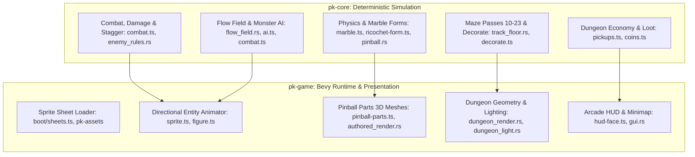

# Comprehensive Plan: Pinball Knight Full Systems Port (Physics, Animations, Maze Dungeon, Monsters, Art, Boosters)

**Version 1.0 · Date: 2026-08-13 · Author: Antigravity**
**Standard: Verified-Claim Plan Methodology (VCPM / `.agents/plan-verification-standard.md`)**
**Workspace: `/home/lazycat/github/projects/sun/pinball-knight`**
**Status: PROPOSED PLAN (Awaiting User Review — Read-Only Mode)**

---

## 1. Executive Summary & Problem Statement

### 1.1 Problem Statement
The new Rust + Bevy engine for **Pinball Knight** has successfully ported the deterministic foundations (intro sequence, tavern hub, 9/23 maze topology passes, static data tables, and headless physics calculations with 882+ passing unit tests, 32.3% line coverage), but the live dungeon gameplay remains a skeleton:
1. **Physics & Momentum**: Lacks runtime marble material forms (fire, ice, steel, storm, lava, terrain), ricochet exit forms, and spinpad phase transitions.
2. **Sprite Animations & Directional Rigs**: Monsters currently render as static, un-animated single-facing (`zombie-E`) billboards. The 13 monster kinds lack multi-directional sheets (`S`, `N`, `E`/`W`), walk cycles, attack frames, stagger/hit flashes, and death animations.
3. **Maze Dungeon Generation & Geometry**: The procedural generator only executes passes 1–9. Passes 10–23 and `decorateMaze` (which author all boosters, bumpers, torches, secret walls, and room contents) are unported, so generated mazes rely on pre-baked JSON fixtures.
4. **Monster AI, Spawning & Combat**: The 13 bestiary monsters stand frozen at spawn tiles without live AI, flow-field steering, attack cooldowns, projectile launching, or damage interaction.
5. **Pinball Boosters & Parts Art**: Bumpers, booster chevrons, springs, flippers, rails, and deflectors render as primitive placeholder colored boxes/cylinders rather than animated, lit 3D arcade pinball hardware.
6. **HUD & In-Game UI**: In-game health, rage meter, combo multiplier, equipped weapon, active skill cards, and minimap are not yet composited into the gameplay viewport.

### 1.2 Target Deliverable
A complete, 1:1 playable dungeon crawler experience where the knight descends into procedurally generated multi-room mazes with high-velocity pinball physics, interactive boosters/bumpers, animated directional monster hordes driven by flow-field AI, full ARPG combat, rich pixel-art lighting, and an arcade HUD.

---

## 2. Claim Classification & Traceability Matrix (VCPM Gating)

| Claim ID | Classification | Statement | Source / Verification Path |
|---|---|---|---|
| **CLAIM-01** | **Verified Fact** | The Rust workspace compiles cleanly with 882+ passing unit tests (`cargo test --workspace` exit 0). | Measurement: `cargo test --workspace` on 2026-08-13 |
| **CLAIM-02** | **Verified Fact** | The provenance ledger tracks 88,312 lines in Tier 1 target with 28,562 lines ported (32.3%). | Measurement: `cargo xtask coverage` on 2026-08-13 |
| **CLAIM-03** | **Verified Fact** | `pk-core::pinball` already contains core restitution, sub-stepping, rails, and combo-curve calculations. | Code inspection: `crates/pk-core/src/pinball.rs` lines 1–1030 |
| **CLAIM-04** | **Verified Fact** | The legacy TypeScript oracle under `legacy/src/game/pinball-knight/` contains the authoritative implementations and 228 test suites. | Code inspection: `legacy/src/game/pinball-knight/` |
| **CLAIM-05** | **Testable Claim** | Porting passes 10–23 into `pk-core::maze` will enable generated floors to produce bit-exact layouts matching legacy fixtures. | Testable via `tests/maze_pass_digests.rs` on 10 corpus floors |
| **CLAIM-06** | **Testable Claim** | Adding directional `SheetClips` (`S`, `N`, `E`) to Bevy entity renderers will animate walk and combat cycles for all 13 monster kinds. | Testable via `scripts/pk-ab-dungeon.mjs` visual diff |
| **CLAIM-07** | **Assumption-1** | Bevy 0.15/0.17 instancing or merged mesh batching for pinball parts will maintain ≥60 FPS on host GPU. | Risk: High draw-call overhead on large mazes; Mitigation: Merged mesh per bucket in `dungeon_render.rs` |
| **CLAIM-08** | **Assumption-2** | Flow-field pathfinding with 72 active monsters will execute in <50 µs per tick in `pk-core`. | Risk: Tick latency spike; Mitigation: Benchmark B1 shows `flow_step_x1000` is 7.6 µs |

---

## 3. Subsystem Breakdown & Architecture Plan

---

## 4. Phase-by-Phase Implementation Modules

### Phase 1: Pinball Physics & Marble Material Forms (`pk-core` + `pk-game`)
- **Target Files**:
  - `legacy/src/game/pinball-knight/entities/marble.ts` (1,005 lines) → `crates/pk-core/src/marble.rs` [NEW]
  - `legacy/src/game/pinball-knight/entities/ricochet-form.ts` (360 lines) → `crates/pk-core/src/ricochet.rs` [NEW]
  - `legacy/src/game/pinball-knight/entities/hazards.ts` (180 lines) → `crates/pk-core/src/hazards.rs` [NEW]
  - `crates/pk-core/src/pinball.rs` (wire marble material hooks)
- **Key Deliverables**:
  1. **Marble Material System**: Port `Standard`, `Steel` (heavy mass, destructive impact), `Fire` (ignition trails, burn ticks), `Ice` (frictionless slide, freeze shock), `Storm` (lightning arcs, magnetic draw), `Lava` (lava immunity, magma bursts), `Shadow` (phase through enemies).
  2. **Ricochet & Spinpad Dynamics**: Exit velocity multiplication, angular velocity redirection on spinpads, lane guidance magnetics.
  3. **Deterministic Unit Tests**: Port vitest suites `marble-forms.test.ts`, `marble-steel.test.ts`, `marble-lava.test.ts`, `ricochet-trail.test.ts`.

---

### Phase 2: Sprite Animations, Multi-Facing Rigs & Sprite-Forge Pipeline (`pk-assets` + `pk-game`)
- **Target Files**:
  - `legacy/src/game/pinball-knight/boot/sheets.ts` (586 lines) → `crates/pk-assets/src/sheets.rs` [NEW]
  - `legacy/src/game/pinball-knight/engine/render/sprite.ts` (1,697 lines) → `crates/pk-game/src/sprite_anim.rs` [NEW]
  - `legacy/src/game/pinball-knight/engine/render/figure.ts` (575 lines) → `crates/pk-game/src/figure.rs` [NEW]
  - `crates/pk-game/src/authored_render.rs` (multi-facing monster renderer)
- **Key Deliverables**:
  1. **3-Facing Runtime Sheet Loader**: Load `S`, `N`, `E` directions for all 13 monster types and player knight; derive `W` by horizontal UV flip.
  2. **Animation State Machine**: Idle (breathing 2-frame), Walk (4-frame loop), Attack windup/strike, Stagger/Pain flash, Death dissolve/shatter.
  3. **Sprite Atlas Validation**: Ensure zero missing frames or 404s via `assets/fixtures/legacy-404-allowlist.json`.

---

### Phase 3: Maze Dungeon Generator Completion (Passes 10–23 + `decorateMaze`)
- **Target Files**:
  - `legacy/src/game/pinball-knight/maze/decorate.ts` (3,169 lines) → `crates/pk-core/src/maze/decorate.rs` [NEW]
  - `legacy/src/game/pinball-knight/maze/artery-banks.ts` (620 lines) → `crates/pk-core/src/maze/artery_banks.rs` [NEW]
  - `legacy/src/game/pinball-knight/maze/floor-rules.ts` (650 lines) → `crates/pk-core/src/maze/floor_rules.rs` [NEW]
  - `legacy/src/game/pinball-knight/maze/assembly-place.ts` (450 lines) → `crates/pk-core/src/maze/assembly_place.rs` [NEW]
  - `legacy/src/game/pinball-knight/maze/relay-chambers.ts` (320 lines) → `crates/pk-core/src/maze/relay_chambers.rs` [NEW]
  - `crates/pk-core/src/maze/track_floor.rs` (advance `PASSES_LANDED` from 9 to 23)
- **Key Deliverables**:
  1. **Passes 10–23 Execution**: Artery banks, doorway funnels, spacing grids, floor rules, assembly place, relay chambers, surface paint, lamp puzzle, track sockets, launch pads, and fallback growth.
  2. **`decorateMaze` Pipeline**: Automatic procedural placement of boosters, bumpers, springs, torches, breakable secret walls (`T_CRACKED`), and loot containers.
  3. **10-Floor Digest Certification**: Verify generated grids against oracle fixtures with bit-exact hash validation in `tests/maze_pass_digests.rs`.

---

### Phase 4: Monster Roster, Bestiary AI & ARPG Combat System (`pk-core` + `pk-game`)
- **Target Files**:
  - `legacy/src/game/pinball-knight/entities/zombie.ts` (1,217 lines) → `crates/pk-core/src/zombie_ai.rs` [NEW]
  - `legacy/src/game/pinball-knight/entities/combat.ts` (1,204 lines) → `crates/pk-core/src/combat.rs` [NEW]
  - `legacy/src/game/pinball-knight/entities/projectiles.ts` (807 lines) → `crates/pk-core/src/projectiles.rs` [NEW]
  - `legacy/src/game/pinball-knight/spawn/factory.ts` (525 lines) → `crates/pk-core/src/spawn_factory.rs` [NEW]
  - `legacy/src/game/pinball-knight/spawn/floor-populate.ts` (363 lines) → `crates/pk-core/src/floor_populate.rs` [NEW]
  - `crates/pk-game/src/main.rs` (live monster update & combat systems)
- **Key Deliverables**:
  1. **The 13 Monster Kinds**:
     - `Zombie` (Basic walker, crawler limb-drag, brute heavy smash, spitter acid pool)
     - `Skeleton` (Shield bash, archer arrow volley)
     - `Goblin` (Fast skitter, thief gold snatch)
     - `Croaker` (Hop repositioning, explosive corpse burst on death)
     - `Stiltneck` (High-arc bomb tosses, long-range artillery)
     - `Jester` (Spring leaps, trick box traps)
     - `Ghost` (Ethereal wall-phasing, chill aura)
     - `Reaper` (Scythe sweep, soul vortex)
     - `Boss` (Multi-phase encounter: charge, bullet-hell rings, minion summon, shield invulnerability)
  2. **Flow-Field Steering**: 60 Hz entity steering along gradient vector fields towards the knight.
  3. **Combat Pipeline**: Hitbox collision, damage calculation with weapon modifiers, stagger buildup, knockback impulse, invulnerability frames, and floating damage numbers.

---

### Phase 5: Pinball Hardware & Boosters 3D Art Engine (`pk-game`)
- **Target Files**:
  - `legacy/src/game/pinball-knight/render/pinball-parts.ts` (1,611 lines) → `crates/pk-game/src/pinball_render.rs` [NEW]
  - `crates/pk-game/src/authored_render.rs` (replace colored box placeholders with real geometry)
  - `crates/pk-game/src/dungeon_render.rs` (batched dynamic parts)
- **Key Deliverables**:
  1. **Pop Bumpers**: 3D chrome base, mushroom cap, animated inner flash coil upon collision.
  2. **Boost Chevrons**: Directional glowing arrow runway with scrolling UV pulse animation.
  3. **Launch Springs & Slingshots**: Compressible coil spring geometry and angled elastic kicker bands.
  4. **Rails & Spinpad Rings**: Polished tubular metal guide rails, rotating star spinpads with particle sparks.
  5. **Drop Targets & Rollovers**: Recessed ground buttons with glowing activation states.

---

### Phase 6: In-Game HUD, Minimap & Dungeon Economy (`pk-gui` + `pk-game`)
- **Target Files**:
  - `legacy/src/game/pinball-knight/hud-face.ts` (1,330 lines) → `crates/pk-gui/src/hud_face.rs` [NEW]
  - `legacy/src/game/pinball-knight/gui/screens/hud.ts` (404 lines) → `crates/pk-gui/src/screens/hud.rs` [NEW]
  - `legacy/src/game/pinball-knight/hud-minimap.ts` (320 lines) → `crates/pk-gui/src/minimap.rs` [NEW]
  - `legacy/src/game/pinball-knight/economy/pickups.ts` (243 lines) & `coins.ts` (234 lines) → `crates/pk-core/src/economy/dungeon.rs` [NEW]
- **Key Deliverables**:
  1. **HUD Overlay**: Hero portrait, animated health globe/bar, rage meter, combo tally counter, gold/gem totals, equipped weapon icon, and active ability cooldown cards.
  2. **Minimap Radar**: Real-time fog-of-war exploration map displaying discovered rooms, stairs exit, boss icons, and item markers.
  3. **Loot Drops**: Floating spinning gold coins, health potions, mana vials, card packs, and reagent pickups with magnet attraction to the knight.

---

## 5. Risk Assessment & Verification Gates

| Risk | Impact | Mitigation Strategy |
|---|---|---|
| **Determinism Drift between TS & Rust** | Desynchronized replay / test failures | Enforce `f64` + `jsmath` math wrappers exclusively in `pk-core`; run golden trace fixtures on every commit. |
| **Render Bottlenecks on Large Mazes (194×146 grid)** | Frame drops below 60 FPS | Occlusion cull buried wall faces; merge static tiles into 5 texture buckets; use pooled point lights (`TORCH_LIGHT_POOL = 6`). |
| **Missing Sprite Facings Causing 404s/Black Boxes** | Visual glitches | Maintain strict facing allowlist; fall back to flipped `E` for `W` and reuse existing facing if `N`/`S` is missing. |

---

## 6. Execution Order & Next Steps

1. **Step 1**: Review and approve this comprehensive implementation plan.
2. **Step 2**: Create a dedicated git worktree for the migration branch (e.g. `.worktrees/wt-gameplay-systems` on `feature/gameplay-systems`).
3. **Step 3**: Execute Phase 1 (Physics & Marble Forms) + Phase 2 (Sprite Animation Rigs).
4. **Step 4**: Execute Phase 3 (Maze Passes 10-23 & Decorate) + Phase 4 (Monsters, Bestiary AI & Combat).
5. **Step 5**: Execute Phase 5 (Pinball Parts Art) + Phase 6 (HUD & Economy).
6. **Step 6**: Run full test suite, verify A/B visual parity on Windows desktop (`scripts/pk-win.sh run --release`), and deploy container (`npm run deploy`).
