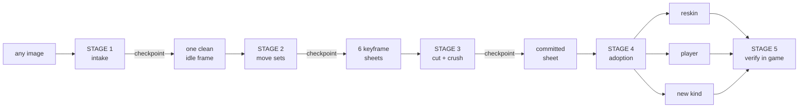

# Any image → a living character in the dungeon

> [!IMPORTANT]
> **This document is the progress tracker, not a snapshot.** Tick the boxes as stages
> land. If a session ends mid-build, resume from here rather than re-deriving the
> research — every claim below carries a `file:line` anchor that was verified on
> 2026-08-05.

The forge already does the **middle** of this job. What it cannot do is the two ends:
take an arbitrary photo and make it usable, and turn a finished sheet into anything more
than a reskin. This is the road from one end to the other.



**Design rules this road obeys** (each one was learned the hard way — see *Lessons* at the
end):

- Rendering is measured, never assumed. Every stage boundary has a gate that reports
  numbers a human can act on.
- One canonical crush. Generation stays soft and large; `commit.ts` is the only place art
  becomes pixels.
- GPU work is a **mode** (`comfy/modes.mjs`); measurement and geometry are a **pipeline
  op** (`app/api/comfy/pipeline/route.ts`). That split is what makes checkpoints cheap.
- `tools/sprite-forge/` stays free of node-only imports —
  `testkit/testkit-boundary.test.ts` enforces it. Node-canvas belongs at the route edge.

---

## Status

| Stage | What | Status |
|---|---|---|
| 0.0 | This document | ✅ done |
| 0.1 | Knight published art is dead (sidecars, not manifests) | ✅ **shipped + verified live `57b0511`** |
| 0.2 | Sheet tray cannot reach crush controls | ✅ shipped |
| 0.3 | `KNOWN_CLIPS` missing `ball` | ✅ shipped |
| 1 | Intake: any image → one clean idle frame | ✅ shipped + proven live |
| 2 | Move sets from one idle frame | ✅ shipped `a2ada3b` |
| 3 | Assembly + crush | ✅ shipped |
| 4a | Reskin an existing monster | ✅ works; ⬜ panel should write the map entry |
| 4b | Playable character | ✅ `__lab.playAs("frog")`; ⬜ surface in `InGameCard` |
| 4c | Brand-new monster kind | ⬜ |
| 5 | Verify in game | ✅ shipped `61b39bf` |
| **6.1** | **Build plan + camera-per-facing** (`build-plan.ts`) | ✅ types `57b0511`; ✅ **wired into `modes.mjs` `f4d55f1`** (`camera-sync.test.ts` pins the copies) |
| **6.2** | **Drift gate** (`drift.ts`) | ✅ shipped + calibrated `57b0511` |
| **6.3** | **Build planner route** `/api/comfy/build` | ⬜ not started |
| **6.4** | **Review workspace** (contact sheet, per-cell repair) | ⬜ not started |
| **6.5** | **Regenerate a character end-to-end through the builder** | ⬜ not started |
| **7.1** | **Facing standard + `mirror`** (sidecar→manifest→draw) | ✅ shipped 2026-08-05 — see `FACING_STANDARD.md`; knight-E + zombie-E declared |
| **7.2** | **Compass calibration sheets** (`prep/make-compass.mjs` + `compass.test.ts`) | ✅ shipped — `__lab.playAs("compass")` to verify in-game |
| **7.3** | **Real pixels: `trace-manifest`** (published sheet → editable `AuthoredCell` set) | ✅ shipped — export-only; ⬜ `publish-set` (edited set → sheet) not started |
| **7.4** | **Regenerate frog-E / stiltneck-E as true side views** | ⬜ — they are front views under an E label (audit in `FACING_STANDARD.md`) |

---

## Stage 0 — Fix what is broken

### 0.1 The knight's published art was dead ✅ `57b0511`

**Symptom:** `public/sprites/pinball_knight-{S,N,E}.json` were forge **sidecars**
(`rows`/`rects`/`commit`), not `SheetManifest`s. `loadImportedSheet`
(`render/imported-paints.ts:42`) set `img.src = "undefined"`, 404'd, returned `null`, and
the player rendered 100% procedurally **with no log line at all**.

That was the third bug in a chain, and the first two are the ones worth remembering.

**1 — a check that could never pass.** `commitToGrid` widens the gutter until the sheet
"re-slices to the declared shape". That test assumes **one declared cell is one connected
blob**. The knight's spin attack opens with the body *and a swung element clear of it* —
two blobs, one legitimate frame, correctly declared as one cell. `sliceSheet` counts
blobs, so it reported one cell more than declared **at every gutter in the range**. The
loop exhausted itself and threw on art that was fine.

**2 — the throw aborted the whole batch.** E's manifest was written; S and N never were.
One creature's crush problem cost six other sheets their publish.

**3 — so somebody routed around it** by hand-copying the inbox sidecars into
`public/sprites/`. Hence the symptom.

**Fixes.** `separated()` in `commit.ts` replaces the count-equality test with the
invariant the gutter actually has to guarantee: every sliced blob nests inside exactly one
placed cell, and every placed cell holds at least one blob. A two-piece pose passes; two
figures merged by a tight gutter still fails. `inbox.test.ts` now collects crush failures
and asserts *after* the loop, so every sheet publishes and the run still goes red. The
`spin_attack` row — never a `ClipName`, always dropped on import — is renamed `attack`
(same-named rows append, so the frames survive).

**Result:** crushes at `PIXEL GRID ×8, confidence 100%, block-reduce EXACT`, publishes
with `grid: 8` on all three facings, sheet 3.5 MB → 189 KB. Verified on the live
container: `[dungeon] player: imported pinball_knight art loaded`.

> [!IMPORTANT]
> **A check that cannot pass is worse than no check**, because someone will route around
> it and the workaround is invisible. Both signs were present for weeks: a test that threw
> every run, and a published file whose shape no writer in the codebase produces.

### 0.2 The panel cannot reach the crush controls ✅

`components/forge/SheetTray.tsx:97` hardcodes `sidecar = { rows: rowsInUse }`. So
`commit.derive`, `commit.mode`, matte tolerance and `rects` are unreachable from the UI.

Measured on the frog (2026-08-05): `derive: 20` took the sheet from 32 → 20 palette
entries, isolated texels 24.8% → 16.4%, run length 1.58 → 1.74, and the verdict from
"resampled" to **`imports 1:1 at atlas grid ≥ 84`**. This is not a nicety.

### 0.3 `KNOWN_CLIPS` is missing `ball` ✅

`tools/sprite-forge/labels.ts:23` omits it while `PLAYABLE`
(`render/imported-paints.ts:284`) accepts it — a `ball` row is reported as an unknown clip
yet works at runtime. Matters for the player path.

---

## Stage 1 — Intake: any image → one clean idle frame ✅

The largest piece, and the one that makes "any image" true.

### The output contract

Everything downstream inherits this frame's framing, scale and identity, so the contract
is strict:

| # | requirement | why |
|---|---|---|
| 1 | PNG RGBA, exactly **1024×1024** | matches `qwenEdit`'s latent (`comfy/graphs.mjs:75-76`) |
| 2 | background transparent in alpha **and** flat `#ffffff` in RGB | belt and braces: `matte.ts` needs a flat opaque border, `sliceSheet` needs alpha, and a frame that loses alpha in a diffusion round-trip still mattes |
| 3 | exactly **one** 4-connected opaque component ≥1% of canvas | the "two frogs" failure |
| 4 | subject height **0.72 ± 0.04 × H**, width ≤ 0.75 × W | 0.72 subject + 0.10 floor + 0.18 headroom, because `keyframes` re-poses *from* this frame and a raised sword must not clip |
| 5 | feet at **y = 0.90 H ± 2px** | mirrors the engine's `ART_GROUND/ART_BOX = 118/128` with selout room |
| 6 | bbox centre x = W/2 ± 2px | the same anchor `register.ts:148` uses |
| 7 | no debris below the feet, no text, no detached shadow | `register.ts:72-80`: debris below the feet lifts the character |
| 8 | a sidecar `{source, bbox, feetY, centreX, scale, seg, qa}` travels with it | makes the run reproducible |

### The sequence

| # | step | kind |
|---|---|---|
| 0 | decode + clamp long side to 768–1536 (aspect untouched) | reuse `decodeSheet()` `app/api/comfy/pipeline/route.ts:101` |
| 1 | letterbox to 1024² on **mid-grey `#808080`** — a white-clad subject on white is the worst case for a saliency head | new |
| 2 | **background removal** | ComfyUI core nodes (below) |
| 3 | mask clean-up: threshold α≥128, keep largest component + any ≥1% that does not touch the edge | `matte.ts:332-347` erode + `prep/prep-sheet.mjs:209-245` `dropBleed` |
| 4 | crop + reframe: `k = 0.72H/bboxH` clamped by width, blit centred with feet at 0.90H, resample with `resampleCell(…, "box")` **never `drawImage`** | lift from `prep/prep-sheet.mjs:364-414` + `register.ts:92-150` |
| 5 | flatten onto the key field (composite over opaque white, re-apply alpha) | new, ~15 lines |
| 6 | **CHECKPOINT A** — single-frame QA | new |
| 7 | style conversion — the existing `pixelize` prompt **minus** the geometry clauses (steps 3-5 now guarantee them; asking Qwen to re-centre an already-centred frame is how it gets moved) | `comfy/modes.mjs` |
| 8 | **re-key + re-register** — Qwen returns an opaque frame with the character off the feet line. `matte()` now succeeds (a flat white field is what its border estimator was written for), then re-run step 4 with identical constants | `matte.ts` + step 4 |
| 9 | **CHECKPOINT B** — QA again + `detectPixelGrid` verdict | new |
| 10 | emit frame + sidecar → `ctx.images.init` for `keyframes` | new |

> [!NOTE]
> **Deliberately excluded:** palette-mapping and the 1px outline from
> `prep/pixelize.mjs:132-175`. Those belong to the crush. Quantising at intake means the
> idle frame is crushed before Qwen ever sees it — a second canonical crush, which
> `comfy/graphs.mjs`'s own header argues against.

### Background removal — core ComfyUI, no custom node

Verified present on this box 2026-08-05 (`/object_info`): `LoadBackgroundRemovalModel`,
`RemoveBackground`, `InvertMask`, `JoinImageWithAlpha`, `MaskToImage`, `ThresholdMask`,
`GrowMask` — all core, from [Comfy-Org/ComfyUI#12747](https://github.com/Comfy-Org/ComfyUI/pull/12747).
Sizes below were fetched from the HF API on 2026-08-05, not recalled.

| model | file | bytes | licence | note |
|---|---|---|---|---|
| BiRefNet | `background_removal/birefnet.safetensors` | 444,473,596 | MIT | the default — installed |
| Lucida | `background_removal/lucida.safetensors` | 884,878,856 | MIT | finetune for transparent objects, glow/VFX, **illustrations** — our hard half |

> [!NOTE]
> **This section previously "rejected" [`1038lab/ComfyUI-RMBG`](https://github.com/1038lab/ComfyUI-RMBG)
> over GPL-3.0. That rejection was wrong and is withdrawn** (2026-08-05). It cited a
> licence bar in `comfy/manifest.mjs`'s header that no one ever set — the comment asserted
> the rule and the doc cited the comment. GPL-3.0 governs *distributing* a local ComfyUI
> plugin; it says nothing about the PNGs the plugin produces. **Licences are recorded, not
> enforced.** The pack is the better tool — one dropdown over RMBG-2.0, BiRefNet, BEN2,
> INSPYRENET, SDMatte and SAM/SAM2/SAM3 — and SAM3's text-prompted segmentation is the
> only way to *rescue* a thin feature (a spear, an antenna) that a saliency head ate,
> rather than accepting the amputation.

**Graph shape** (new builder in `comfy/graphs.mjs` — the only place class names may live):

```
bg   : LoadBackgroundRemovalModel { bg_removal_name }
img  : LoadImage { image }
m    : RemoveBackground { bg_removal_model, image }   → MASK, 1 = subject
inv  : InvertMask { mask }
rgba : JoinImageWithAlpha { image, alpha:[inv,0] }
outA : SaveImage  → the cutout
mi   : MaskToImage { mask:[m,0] }
outM : SaveImage  → the raw mask (QA measures this; the brush edits it)
```

> [!CAUTION]
> **The `InvertMask` is load-bearing.** Core's `JoinImageWithAlpha` computes
> `alpha = 1.0 - mask`, while `RemoveBackground` returns a *foreground* mask. Wiring them
> directly produces an image transparent exactly where the character is.

**Run it as a separate small graph, before the edit** — not fused into `qwenEdit`. It keeps
`qwenEdit` untouched, lets the cutout be approved on its own (~8s vs 100-260s), and means a
failed segmentation costs seconds.

> [!WARNING]
> Give the segmentation mode **`leg: "qwen"`**. `leg` is the `/free` key in
> `app/api/comfy/generate/route.ts`; a new leg id would force a full unload + 13GB reload
> between "segment" and "style" — exactly the thrash the leg-affinity scheduler exists to
> prevent. BiRefNet at 444MB coexists with Qwen on 24GB.

### Single-frame QA (`op:"qa"`) — the checkpoint gate

Returns a **three-valued verdict**, because a human must be able to say "good enough":
`ready` (all green) · `usable` (works, at a named cost) · `reject` (downstream provably
breaks).

| # | check | computed by | threshold | why that number |
|---|---|---|---|---|
| 1 | matte-able | `estimateBackground()` `matte.ts:164` + `matte()` | confidence ≥ 0.90, 0.05 < keyed < 0.95 | these **are** `MIN_BG_CONFIDENCE`/`MIN_KEYED`/`MAX_KEYED` (`matte.ts:141-144`) — intake's job is to make the downstream gate pass, so its threshold *is* that gate |
| 2 | alpha present | `clearShare()` `sheet-cut.ts:60` | ≥ 0.20 | `OPAQUE_BELOW=0.05` only means "someone keyed this"; a contract-compliant frame clears 20% even at max subject width |
| 3 | exactly one figure | new `blobs.ts` labeller | 1, after dropping components <1% of the largest | 1% not `dropBleed`'s 0.14% — that is tuned for slivers between poses; here a detached prop is real art |
| 4 | sane size | alpha bbox | 0.68 ≤ h/H ≤ 0.76, w/W ≤ 0.75 | see contract #4 |
| 5 | feet resolvable | lowest opaque row + `keyBands()` `prep-sheet.mjs:177` | \|feetY − 0.90H\| ≤ 2 **and** bottom-5% width ≤ 0.6×bboxW | the second half catches a ground shadow / plinth / 3D contact plane — a wide flat band |
| 6 | slices as one cell | `sliceSheet()` `slice.ts:117` | exactly 1 row × 1 cell, matching the bbox ±2px | cheapest proof `cutSheet` won't surprise us later |
| 7 | pixel-grid honesty | `detectPixelGrid()` `grid.ts:218` | report verbatim, **never a reject** | generated art always says "NOT PIXEL ART … will be RESAMPLED" — that is expected |
| 8 | off-canvas clipping | any opaque pixel on the border rows/cols | zero | a clipped limb becomes a clipped limb in all 24 keyframes |

Also report an **upscale advisory**: source figure height before scaling. Beyond ~4× the
style pass is hallucinating detail, not recovering it → `usable` + warning.

### Files

**New (all pure, no node imports):**
- `tools/sprite-forge/intake.ts` — contract constants (`INTAKE_PX=1024`, `SUBJECT_H=0.72`,
  `FEET=0.90`), `letterbox()`, `reframeSubject()`, `flattenOnKey()`, inverse transform
- `tools/sprite-forge/intake-qa.ts` — `qaFrame() → IntakeVerdict`
- `tools/sprite-forge/blobs.ts` — one 4-connected labeller (the algorithm exists **twice**
  already: `matte.ts:288-323` and `prep-sheet.mjs:209-245`; extract once)
- `intake.test.ts`, `intake-qa.test.ts`
- `components/forge/IntakeCard.tsx`, `components/forge/QaVerdict.tsx`

**Changed:** `comfy/graphs.mjs` (+`bgRemove`), `comfy/modes.mjs` (+`segment`,
+`intake-style`), `comfy/manifest.mjs` (+intake leg), `app/api/comfy/pipeline/route.ts`
(+`prep`/`reframe`/`qa` ops, `stage` gains `kind:"idle"`), `components/ForgePanel.tsx`
(+intake tab).

**API surface:**
```
POST /api/comfy/pipeline {op:"prep",   imageB64}            → {frameB64, transform}
POST /api/comfy/generate {mode:"segment", imageB64}         → GPU ~8s
POST /api/comfy/pipeline {op:"reframe", frameB64, maskB64?} → GPU-FREE, instant
POST /api/comfy/pipeline {op:"qa",      frameB64}           → CHECKPOINT A
POST /api/comfy/generate {mode:"intake-style", …}           → GPU 100-260s
POST /api/comfy/pipeline {op:"reframe"} → {op:"qa"}         → CHECKPOINT B
POST /api/comfy/pipeline {op:"stage", kind:"idle", …}
```

### Checkpoint UX

A new `intake` tab before `generate`; one card per stage, each collapsing to a one-line
summary once approved. Fixes are offered **in cost order**:

- **Geometry (0s, no GPU):** re-centre · re-scale · strip the ground shelf · drop the
  second blob · erode 1 ring. All are `{op:"reframe"}` with different opts; QA re-runs
  automatically.
- **Mask (0s, no GPU):** **reuse `MaskEditor.tsx` verbatim** — it already brushes at
  natural size and exports a hard-thresholded B/W PNG (`MaskEditor.tsx:67-85`), which *is*
  a mask. `+` adds foreground (BiRefNet ate the sword), `−` removes (it kept the chair).
  *This is the highest-value reuse in the design* — it turns "90% right" from a re-roll
  into ten seconds of brushing.
- **Regenerate (GPU):** re-cut with Lucida · repair with `touchup` through the existing
  `requestMode()` plumbing (`ForgePanel.tsx:145-155`).

Stage 2 adds an **A/B slider against the cutout** — identity drift is what to catch there
and it is invisible in a single image — plus a crush preview at atlas size (extract the
widget `SheetTray.tsx:294-301` already renders).

Nothing restarts: each card holds its own output, and stepping back keeps everything
before it.

> [!TIP]
> **PROVEN LIVE 2026-08-05.** A 900×1200 photo-like source — gradient sky, textured
> ground, a distractor rock, a cast shadow, character off-centre at 38% height — was
> correctly **REJECTED** raw (6 named failures), then `prep` → `segment` (9s on BiRefNet)
> → `reframe` returned **READY** with all nine checks green: one figure, 72.0% tall,
> feet at y=921 (want 922), centred at 512, 1.9× upscale. The rock and the shadow are
> gone. That is the whole claim of this stage.

Build order used (geometry first, so the whole half was testable before any model
downloaded): `blobs.ts` + `intake.ts` + 15 tests → `reframe`/`qa` ops → manifest entry +
model download → `graphs.mjs bgRemove` + `segment` mode → `IntakeCard`.

---

## Stage 2 — Move sets ✅ `a2ada3b`

`keyframes` mode + **"every move set (6 sheets)"**: idle → walk → run → attack → stumble →
death, every job branching off the **same** init (no chaining ⇒ no inherited drift), each
with its camera pinned (`comfy/modes.mjs` `KEYFRAME_MOVES[].camera`).

`idle` leads the batch because it is **required**: `importedPaints` drops a sheet without
one in silence (`render/imported-paints.ts:288-294, 316-318`; the caller's silent
`continue` is `boot/sheets.ts:364-365`). The stiltneck shipped for weeks and never drew for
exactly this reason.

⬜ **Open question — DECIDED, NOT YET WIRED.** walk/run are authored from a true side
view, attack/stumble/death from three-quarter. Mixing camera angles inside one published
sheet makes a creature teleport between clips.

The decision (2026-08-05): **one camera per FACING, not per move.** `CAMERA_BY_DIR` in
`build-plan.ts` holds it — E is side-on, S faces the camera, N faces away, and every clip
of a facing shares that viewpoint. It costs the attack some three-quarter drama and buys
two things: the creature never pops mid-combat, and every cell in a facing becomes
geometrically comparable, which is what makes `drift.ts` mean anything at all.

> [!WARNING]
> **The constant exists; `modes.mjs` does not read it yet.** `KEYFRAME_MOVES[].camera` is
> still per-move and still authoritative for anything generated today. Wiring it is 6.1's
> remaining half: replace that field, thread the facing through `build(params, ctx)`, and
> keep a per-move override in the type for a deliberate cinematic boss.

---

## Stage 3 — Assembly + crush ✅ (needs 0.2)

Sheet tray → `cut` → `crush` → `stage` → `publish`. The crush preview honours
`commit.derive` as of `4687ede` — before that it previewed the shared palette and lied.

---

## Stage 4 — Adoption

### 4a. Reskin ✅ works, ⬜ automate

Add `<SheetKey>: "<sheetname>"` to `IMPORTED_ART` (`boot/sheets.ts:305`).
`published.test.ts` parses that table **out of the source** and asserts every listed sheet
loads, survives `importedPaints`, and has an `idle` on every facing. Sheets published but
*not* listed are inert — `stiltneck` ships in exactly that state
(`boot/sheets.ts:313-326`). ⬜ The panel should write this entry.

### 4b. Playable character ✅ shipped

`render/knight-sheets.ts:93` `resolvePaints` already merges **imported clips over the
painter's**, and the painter backfills every ride form. The only blocker:
`loadImportedKnightArt()` hardcodes `"pinball_knight"` at `knight-sheets.ts:59-61`.

- parameterise the name; read from localStorage (mirroring `IMPORTED_KEY`
  `boot/sheets.ts:333`), default `"pinball_knight"`
- `__lab.playAs("frog")` beside `__lab.imported()` in `dev/monster-lab.ts`
- surface "play as" in `InGameCard`

> [!NOTE]
> **Ship-with-it gaps, all pre-existing degradations the codebase already chose:** the
> creature turns into the knight for `roll`/`ball`/marble forms (only 6 of 17 player clips
> are in `PLAYABLE`); weapon/armour swaps are invisible on imported frames (gear is
> *painted into* the knight's geometry); the HUD mugshot (`hud-face.ts`) and menu paperdoll
> (`knight-portrait.ts`) stay knight; co-op peers render as your creature.
> Total parity would mean rebuilding the paperdoll model — **scope generated players as
> cosmetically fixed.**

### 4c. Brand-new monster kind ⬜ (scaffold ~60%)

Nine compile-enforced `Record<EnemyKind, X>` tables:

| # | table | file:line |
|---|---|---|
| 1 | `STATS` | `entities/zombie.ts:166` |
| 2 | `HP_BY_KIND` | `spawn/factory.ts:30` |
| 3 | `ENEMY_DROPS` | `reagents.ts:86` |
| 4 | `DMG_BY_KIND` | `entities/combat.ts:1026` |
| 5 | `MOVEMENT_BY_KIND` | `entities/enemy-rules.ts:38` |
| 6 | `PAIN_BY_KIND` | `entities/stagger.ts:69` |
| 7 | `KIND_INFO` | `bestiary.ts:35` |
| 8 | `KIND_STYLE` | `render/card-styles.ts:530` |
| 9 | `KIND_PORTRAIT` | `render/monster-portrait.ts:74` |

> [!WARNING]
> The priming hook (`scripts/hooks/prime-game-context.sh:43`) lists "state" as one of the
> nine. **It is wrong** — `state.ts` only has a `Partial<>` map. The ninth is `STATS`.

Plus: a `spawnKind` case, a constants block (~8 per-kind values), an art route (`RESKIN` or
`EXPANSION_SKIN`), and for its own atlas: `SheetKey`, `BUILDERS`, `state.*Sheet`,
`SHEET_KEY_BY_KIND`, `BACKFILL`/`ESSENTIAL`.

Gates that already exist and catch the rest: `npx tsc --noEmit` (the nine tables) and
`node scripts/hooks/registry-drift.mjs` (checks **A–F**: union coverage, themed spawns
reach `spawnKind`, `EXPANSION_SKIN`↔`KIND_PORTRAIT` agreement, floor-1 atlases in
`ESSENTIAL`, debug-panel spawn route, marble registries). ~50ms, currently clean.

> [!IMPORTANT]
> **A scaffold gets a kind from "does not compile" to "compiles, spawns, drops, has a card,
> drift-clean". It cannot produce a monster anyone would notice was added.** HP, damage,
> speed, `X_FROM_LEVEL`, `PAIN_BY_KIND` (a *ranking* decision calibrated off Doom —
> `entities/stagger.ts:60-65`), `MOVEMENT_BY_KIND` (one of 11 steering modes — this *is*
> the creature's identity), thematic drops, and the behaviour branches (23 in `zombie.ts`,
> 19 in `combat.ts`, 17 in `projectiles.ts`) are design. The scaffold should **prompt** with
> sensible neighbours, never invent.

---

## Stage 5 — Verify in the game ✅ `61b39bf`

`scripts/sprite-shot.mjs` + `/api/comfy/ingame` + the **in game** card: publish → launch
`/dungeon` on the real GPU (Windows Chrome over CDP — WSL2 headless falls back to
SwiftShader and would judge a different image) → `__lab.only(kind)` → screenshots.

The verdict is the boot line the game already prints
(`boot/sheets.ts:369-375`): `<kind>: imported art from N sheet(s) [S/E]`. Empty ⇒ a
**painter** is drawing that creature and the published art never arrived.

> [!CAUTION]
> The harness **must** `browser.close()` (disconnect, not kill) on the way out. A live CDP
> socket holds node's event loop open forever and the spawning route waits on a process
> that finished its work.

---

## Stage 6 — The Character Builder ⬜ (foundations shipped)

Everything above makes a character possible. It does not make one CHEAP. Today the GPU is
the unattended resource and your attention is the scarce one, but the workflow spends them
the other way round: pick a move, launch, wait, find the job card, cut it into cells, drag
rows into the tray — then do that seventeen more times for the other moves and facings.

The forge owns every step and nothing owns the CHARACTER. Stage 6 is that missing object.

**The one rule it must not break:** every generated cell branches off the MASTER, never
off a previous output. Qwen-Image-Edit's identity drift compounds over serial edits, and
it does so smoothly enough that no single step looks wrong. `KEYFRAME_SET` already obeys
this; the planner must not be what breaks it.

### 6.1 `build-plan.ts` ✅ types, ⬜ wiring

`CharacterBuild` is a durable record: one approved master per facing, one camera, a set of
facings, a set of clips, and a row state per `(clip, dir)`. It refuses at PLAN time —
before any weight loads — what would otherwise fail half an hour later:

| refusal | why it exists |
|---|---|
| a name `opStage` would reject | the failure lands on the form field, not after the art |
| a clip outside `KNOWN_CLIPS` | `hurt` is what every reference sheet prints; the engine calls it `stumble` |
| no `idle` | `importedPaints` drops such a sheet whole, in silence |
| skipping `E` | it is the master's own facing |

`jobOrder()` groups a facing's clips together and leads with `idle`. Every job is the
`qwen` leg, so a build enqueued this way pays **zero** model swaps; interleaving a Wan
in-between would cost a 13 GB unload each way.

`deriveState()` computes state from the rows rather than storing it twice — a stored state
and a derived one disagree the moment anything crashes between the two writes, and the
stored one always wins because it is the one that gets read.

### 6.2 `drift.ts` ✅ shipped, calibrated

`intake-qa.ts` asks whether one frame obeys the geometry contract; it cannot ask about
identity, because at intake there is nothing to compare against. Once a build has a master,
"is this still the same creature" becomes a measurement. Nobody honestly reviews 72 cells —
they check the first six and publish. This hands back the short list instead.

| check | verdict | note |
|---|---|---|
| `area` — body mass vs master | **hard** (advisory on off-floor clips) | catches a dropped weapon; death frames legitimately hit 0.61× |
| `palette` — asymmetric OKLab distance | **hard** | passed clean on every shipping sheet; asymmetric so a back view is not punished for lacking a face |
| `aspect` — bbox proportions | **advisory only** | see below |
| `feet` — baseline | advisory | skipped for death/roll/ball/stumble |
| `distinct` — pairwise IoU across a clip's keys | **hard** | the model returning one pose three times animates as a freeze |

> [!IMPORTANT]
> **Calibration refuted one of these metrics, which is why calibration exists.**
> Scored against art the game draws today, bbox aspect came back 28% off (beaver attack),
> 50% (frog walk) and 251% (jester's last death frame) from their own idle. Nothing had
> drifted — a stride is genuinely wider than a stand and a collapsed body is genuinely a
> different rectangle. **Aspect measures pose, not identity.** As a hard gate it would have
> rejected four of four known-good sheets. Demoted, documented, kept as advisory.
>
> The honest limit: reading shipped art to calibrate a gate that judges shipped art
> measures the pipeline against itself. It proves the gate is not insane. Only a real build
> whose flagged cells a human agrees were bad can prove it is RIGHT.

### 6.3 The planner route ⬜

`app/api/comfy/build/route.ts` — a PLANNER, not a second scheduler. It converts a build
into `POST /api/comfy/generate` calls and lets the existing leg-affinity `Sched` order
them. Persists to `work/builds/<id>/build.json`, mirroring how jobs already persist.

**The one place the existing architecture does not stretch:** a 40-minute build must
survive a Next.js hot reload. The job engine currently reports reloaded-away jobs as
`"lost in a dev-server reload — re-roll it"`, which is honest for one job and useless for
eighteen.

### 6.4 The review workspace ⬜

A `build` tab: rows × facings, each cell green / advisory / blocked, with the master as a
**ghost overlay** behind the selected cell — identity drift is invisible in a single image
and obvious against its own reference. Every repair control already exists (`re-roll`,
`touchup`, `MaskEditor`, `op:"reframe"`); the work is routing them at a cell instead of a
job. Two invariants: a repair writes a new revision and never overwrites an approved cell,
and fixes are offered in COST order — free geometry before a 100 s style pass.

### 6.5 End-to-end ⬜

**Not yet done, and the distinction matters:** the knight was *repaired* in `57b0511`, not
*regenerated*. A full intake → keyframes → cut → crush → publish run through the builder
has never been executed. Until it has, 6.1–6.4 are untested against real generated art.

---

## Lessons this road is paved with

Each of these cost a debugging round on 2026-08-05 and is now encoded in the design.

| symptom | actual cause |
|---|---|
| walk cycle "rubs the floor" | prompt described mood, not mechanics — "walking in place, smooth" tells the model to keep everything anchored |
| frames slowly zoom in, head cropped | **ours**: cut cells had different aspect ratios and the FLF node stretches whatever it is given to one square, so it interpolated a scale change |
| the "walk" was a turnaround | pose scripts never pinned the camera, so the model expressed a stride by *rotating* the character |
| colours went muddy after the crush | the preview ignored `commit.derive` and previewed the shared 32-palette |
| every pose came back as a row of copies | a finished **sheet** was fed back as the character reference |
| "undefined" on cut | `urlToB64` returns a complete `data:` URL and the caller prefixed it again; the `` error path rejected with a DOM Event, which has no `.message` |
| box froze at 64GB | ComfyUI parked models in system RAM; an uncapped WSL2 never returns page cache to Windows |
| guard killed healthy jobs 3× | floors were calibrated above the real envelope — a Wan decode legitimately dips to ~1.5GiB available |
