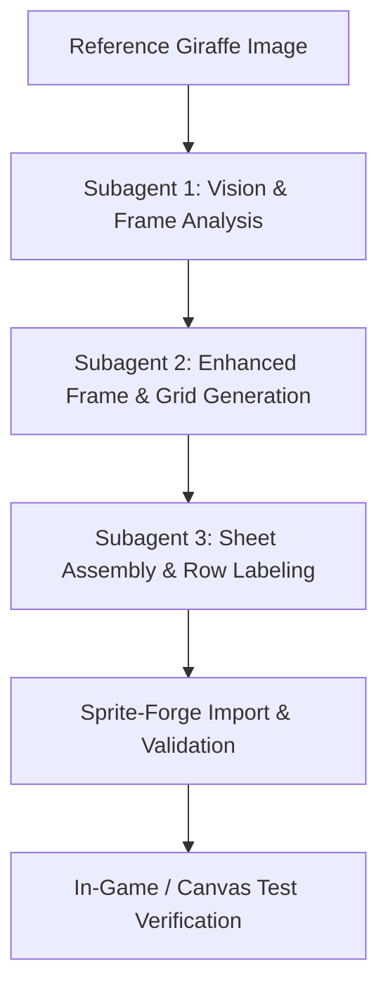

# Implementation Plan — Giraffe (Stiltneck) Sprite Animation Sheet Enhancement & Labeling

Enhance and refine the 20-frame Giraffe (Stiltneck) sprite animation sheet for *Pinball Knight* (`braindeadbot-client`), organize frames into labeled animation rows (walking, attack, dying, etc.), and integrate with the sprite-forge pipeline.

## Overview & Analysis of Reference Sprite Sheet

The reference sheet contains 20 frames of a bomb-carrying giraffe on wooden stilts:
- **Frames 1–10 (Walking / Movement Cycle):** Stately 4-legged walk cycle on stilts with bomb pannier.
- **Frames 11–15 (Attack / Bomb Throw):** Reaches back, coils neck back like a sling, whips neck forward, hurls lit bomb, and recovers stance.
- **Frames 16–20 (Dying / Stumble / Defeat):** Wobbles in alarm (16–17), legs buckle/topple (18), crashes to ground with dizzy stars (19), and sprawl on ground with 'X' eyes (20).

---

## Proposed Subagent & Image Pipeline Architecture



---

## User Review Required

> [!IMPORTANT]
> **Plan Only — No Code or Image Generation Has Executed Yet**
> Per workspace rules, this plan outlines the exact subagent workflow and image generation pipeline. Implementation will only begin after your approval.

---

## Open Questions

1. **Output Format & Text Labels:** Would you prefer the enhanced sprite sheet saved as a single unified PNG with text headers above each row (`WALKING`, `ATTACK`, `DYING`), or as structured individual row assets formatted for the `sprite-forge` inbox (`stiltneck-E.png` and `stiltneck-E.json`)?
2. **Palette & Fidelity:** Should the subagents enhance the sprite sheet preserving the bright cartoon aesthetic, or pre-process/quantize it to match the Cold Crypt torch/leather palette used by Pinball Knight's palette engine (`render/monsters/stiltneck.ts`)?
3. **Facing Angles:** Should we focus solely on the primary 3/4 East facing shown in the reference sheet, or should subagents also generate South (facing camera) and North facing strips?

---

## Proposed Changes

### 1. Image Generation & Processing Pipeline (Subagents)

#### [NEW] [giraffe_spritesheet_labeled.png](file:///home/lazycat/github/projects/sun/braindeadbot-client/src/game/pinball-knight/tools/sprite-forge/inbox/giraffe_spritesheet_labeled.png)
- Clean, enhanced multi-row sprite sheet containing labeled rows:
  - **ROW 1: IDLE / WALK CYCLE** (Frames 1–10)
  - **ROW 2: ATTACK / BOMB THROW** (Frames 11–15)
  - **ROW 3: WOBBLE / STUMBLE** (Frames 16–17)
  - **ROW 4: DYING / DEFEAT** (Frames 18–20)
- High-contrast, clean matte background without checkerboard artifacts.

---

### 2. Sprite-Forge Integration (`braindeadbot-client/src/game/pinball-knight/tools/sprite-forge`)

#### [NEW] [stiltneck-E.json](file:///home/lazycat/github/projects/sun/braindeadbot-client/src/game/pinball-knight/tools/sprite-forge/inbox/stiltneck-E.json)
- Sidecar definition file mapping the row animation clips:
  ```json
  {
    "rows": ["walk", "attack", "stumble", "death"],
    "cells": [10, 5, 2, 3]
  }
  ```

#### [MODIFY] [labels.ts](file:///home/lazycat/github/projects/sun/braindeadbot-client/src/game/pinball-knight/tools/sprite-forge/labels.ts)
- Register `stiltneck` clip naming conventions (`walk`, `attack`, `stumble`, `death`).

---

### 3. Rendering & Monster Verification

#### [MODIFY] [stiltneck.ts](file:///home/lazycat/github/projects/sun/braindeadbot-client/src/game/pinball-knight/render/monsters/stiltneck.ts)
- Ensure frame timings for `walk`, `attack`, `stumble`, and `death` map accurately to the sprite sheet frames.

#### [MODIFY] [stiltneck.test.ts](file:///home/lazycat/github/projects/sun/braindeadbot-client/src/game/pinball-knight/render/monsters/stiltneck.test.ts)
- Add verification test covering frame indexing, slice layout, and palette census for the stiltneck giraffe animation clips.

---

## Verification Plan

### Automated Tests
- Run `npm test -- stiltneck` in `braindeadbot-client` to verify sprite fidelity tests.
- Run `npm run sprites` or `npx vitest run tools/sprite-forge/inbox.test.ts` to test sprite-forge matting, slicing, and resampling pipeline.

### Manual Verification
- Inspect the generated labeled sprite sheet artifact.
- Verify in `preview.png` output of `sprite-forge` that all 4 animation clips (walk, attack, stumble, death) slice cleanly without label bleed.
