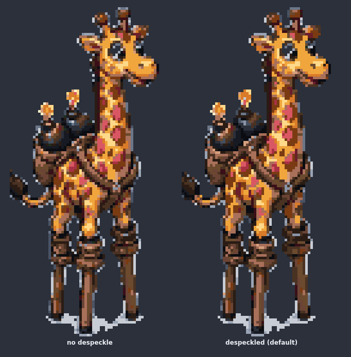
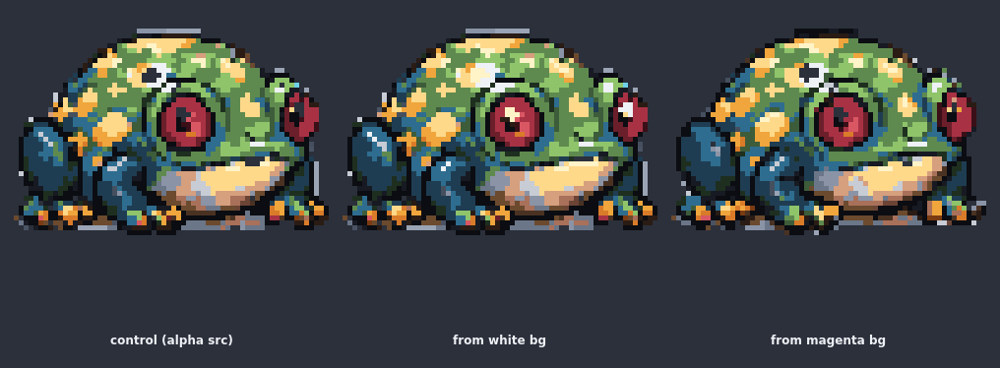
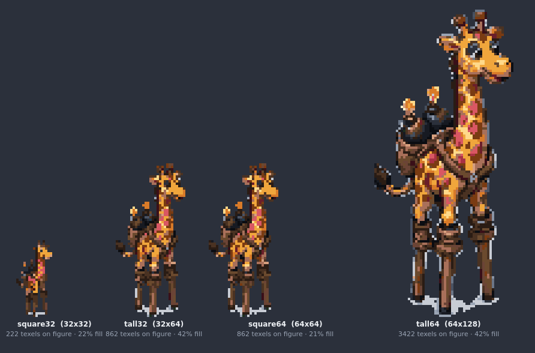
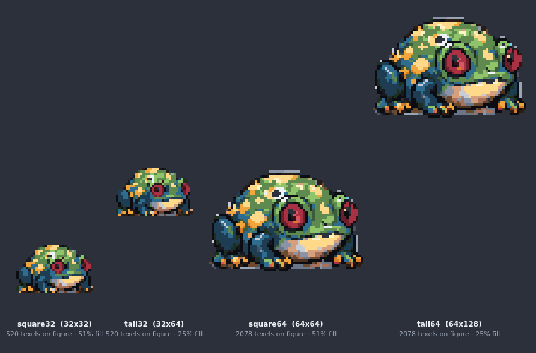
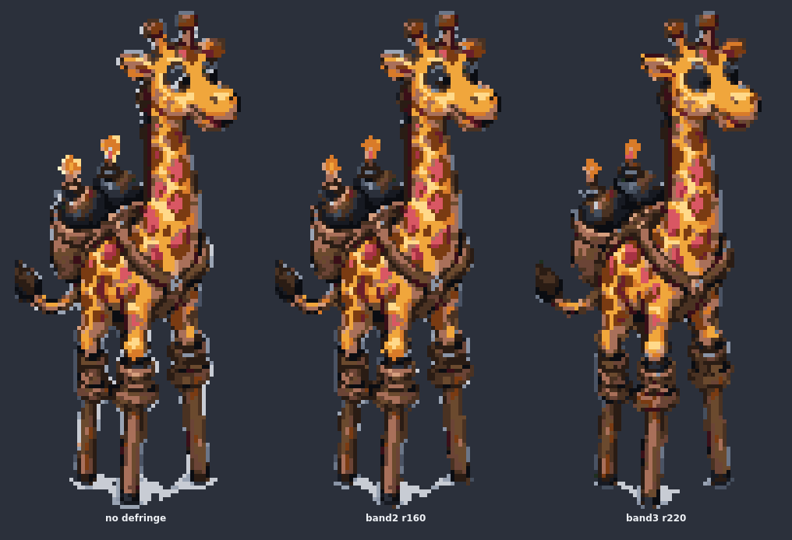
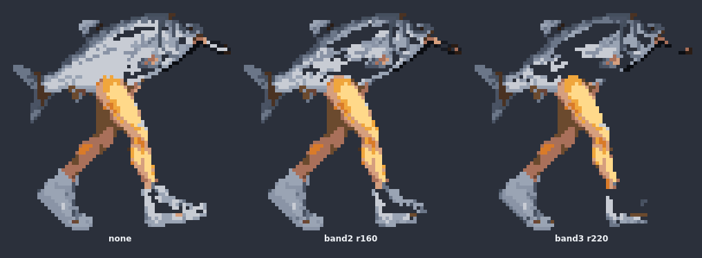
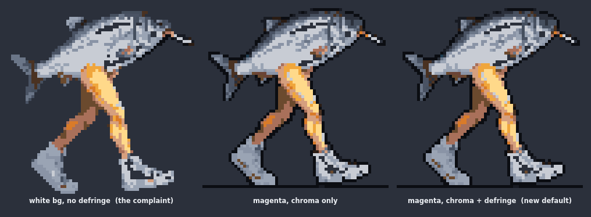

# Noise cleanup, chroma keys and grid choice — measured, 2026-08-02

Third wave of pixel-trace work. The complaint: traces looked better after the
k-centroid/crop wave but carried "AI noise" — and the measurement says that
noise is **edge fringe**, not floating debris. On the traced stiltneck
(tall64), a connected-component census found ONE island — nothing detached —
but 653 of 3422 opaque texels had a colour shared by no neighbour, clustered
on the silhouette and region boundaries: the source's anti-aliased blend
pixels, each landing on a different palette entry.

## Research (what the community does)

- [unfake.js](https://github.com/jenissimo/unfake.js) — the current standard
  for fixing AI pixel art: grid snap → downscale → **morphological cleanup**
  → jaggy cleanup → quantise → **alpha binarization**. Cleanup = replace
  outliers with neighbourhood consensus.
- [Sprite Fusion Pixel Snapper](https://github.com/Hugo-Dz/spritefusion-pixel-snapper)
  — already cloned in the sun root and already evaluated by sprite-forge's
  `grid.ts` (2026-07-31): its grid-snapping assumes a lattice EXISTS; on our
  sheets it locked onto a false 5px lattice and emitted mush. The repo kept
  its two good ideas (cell-purity metric; plurality-per-cell ≈ k-centroid).
  **Verdict: its snapping does not help here; its useful parts are already in.**

## Despeckle — near-duplicate snap, not a mode filter

Two passes after quantisation, on by default (`--no-despeckle`):

1. tiny-island removal (≤2 texels, detached);
2. a texel whose colour NO neighbour shares adopts its chromatically nearest
   neighbouring colour, gated by luma-weighted distance (60²).

The design went through two wrong versions worth remembering: a fixed
5-of-8 plurality filter caught **17** of 653 fringe texels (fringe sits on
silhouettes — half the ring is transparent); share-scaled plurality caught
~40 (boundaries are mixed — no majority to defer to). The property that
identifies quantisation fringe is having a **near-duplicate next door**.
With that: 63–77% of isolated texels cleaned across five monsters, zero
opaque-count change beyond debris, and accents survive (the distance gate:
an eye-glint has no near neighbour).

| monster | isolated before | after | cleaned |
|---|--:|--:|--:|
| stiltneck-E | 653 | 214 | 67% |
| frog-E | 324 | 120 | 63% |
| jester-S | 493 | 155 | 69% |
| beaver-E | 414 | 112 | 73% |
| fish_feet-E | 170 | 39 | 77% |

What despeckle deliberately leaves: the pale background HALO (far from the
figure's colours — the gate protects it as it would an accent). That is
chroma's job.

## Chroma — `--chroma magenta`

A global colour key replacing the border flood matte. The flood matte MUST
leave an enclosed background pocket opaque (a keyed hole and a white glove
are indistinguishable on a white field); a chroma colour never appears in
art, so the global key clears pockets safely — and interior semi-transparent
junk that blends toward the field gets keyed too (the frog's grey head-blobs
vanished in the chroma arm).

Controlled test — the alpha-channel frame is ground truth; the same frame
flattened onto each field and traced:

| | silhouette errors | colour swaps |
|---|--:|--:|
| stiltneck from white (flood matte) | 454 | 120 |
| stiltneck from magenta (chroma key) | **16** | **40** |
| frog from white | 26 | 25 |
| frog from magenta | 67 | 648* |

\* the frog's colour number is palette-neighbour swaps, not damage — the
strip is visually equivalent-or-cleaner; the metric over-penalises adjacent
palette entries. Silhouette is the honest column.

**Generate sheets on flat magenta `#ff00ff` when possible.** Tolerance
defaults generous (60) because a generator cannot be prompted into flat
colour — the field arrives dithered.

## Grid choice — aspect is everything, size is the detail dial

| figure | square32 | tall32 | square64 | tall64 |
|---|--:|--:|--:|--:|
| frog (wide) | **520** | 520 | **2078** | 2078 |
| jester (squarish) | **755** | 752 | **3025** | 3001 |
| stiltneck (tall) | 222 | **862** | 862 | **3422** |

Texels-on-figure. Read it as: a wrong-aspect grid buys only padding — the
frog gains nothing from tall grids, and the stiltneck on `tall32` is
texel-identical to `square64` at half the storage. So: match the grid's
aspect to the figure (`square*` for squarish, `tall*` for tall), then pick
32-class or 64-class by how large it renders.

## Plan audit — vs the original ph-pixels script

| plan feature | status |
|---|---|
| `grids` mode | ✓ (no quad/world columns — these grids own no world geometry) |
| `preview` via vitest gate | ✓ improved: `render` is standalone node-canvas; the plan's vitest rationale (paint lives in game TS) doesn't apply to data cells |
| `trace` --grid/--colours(12)/--alpha(128)/--out | ✓ all, same defaults |
| alphabet-overflow guard | ✓ kept (trace errors; trace-set skips with a note — plan's trace-set silently wrote `undefined`) |
| emit `.ts` module | deviation, deliberate: JSON via `resolveJsonModule` (user-approved at adoption) |
| cell `outline: true` field | not carried — no consumer; outlining is left to hand-edit |
| trace-set per-cell palette + rationale | ✓ kept |
| trace-set CELL_EMPTY warning | ✓ kept |
| QUAD_MISMATCH warning | ✓ as ASPECT_STRETCH (dropped in the first port, restored 2db1d86→841e16a, mostly retired by default crop) |
| repo-relative `source` in trace-set | ✓ fixed this wave — was cwd-relative, now derived from the script's own path |
| trace-set default colours 14 | deviation: uniform 12 everywhere (one default, documented) |
| MIRRORED_GRIDS + `--check` pinning | n/a — single registry here, no mirror to drift |
| import-guard on dispatch | ✓ kept |
| `boxDown` | superseded by k-centroid (kept as `--resample box`) |
| "deliberately not clever" | kept: local ops only, nothing invented; despeckle is gated, defaultable-off, single-pass; hand-edit remains the contract |

## Addendum: defringe, and why 32-grids looked cleaner than 64-grids

The white halo on big grids is the matte's leftover: a 1-2px ring of
background-blended pixels the tolerance cannot key (a half-orange pixel is
nowhere near white). The ring is fixed-width in SOURCE pixels, so the texel
footprint decides its fate — ~6.5px at a 32-grid (k-centroid outvotes it),
~2-3px at a 64-grid (it wins whole texels). **Bigger grids don't add noise;
they resolve contamination that was always there.** Despeckle spares it
correctly: halo texels have allies and are far from the figure's colours.

`defringe` fixes it in source space — the user's instinct ("clean up before
we snap into the grid") was right. Pixels within a band of transparency get
alpha = (dist-to-bg / range)², the compositing-industry soft key.

Sweep on the stiltneck (pale-edge texels, tall64): none 135 → band2/r160 46
→ band3/r220 **23**. But the fish refutes making that a default:

Silver is chromatically near white — pale ART is indistinguishable from halo
by distance-to-background, and band3/r220 hollowed the body and shredded the
sneakers. Hence the shipped asymmetry: **defringe is ON under `--chroma`**
(vs magenta, every art colour incl. silver is 200+ away — unambiguous) and
**opt-in via `--defringe #rrggbb` on the matte path**, for dark-on-light
figures only.

The pale-figure stress test: fish-from-magenta keeps laces, cigarette and
outline with the halo gone entirely. The chroma workflow is the real fix —
white-bg defringe is the manual fallback.
