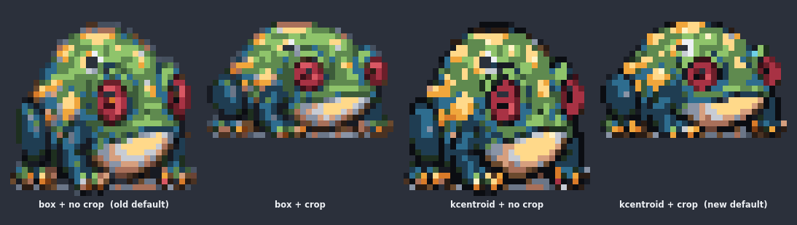
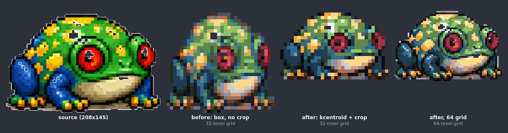
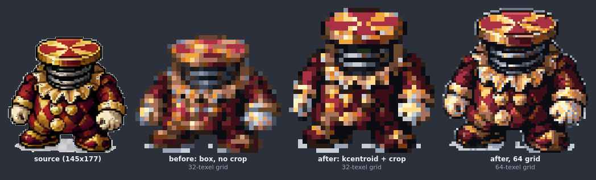
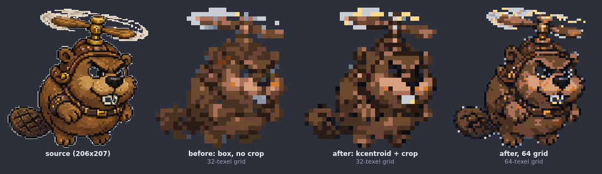
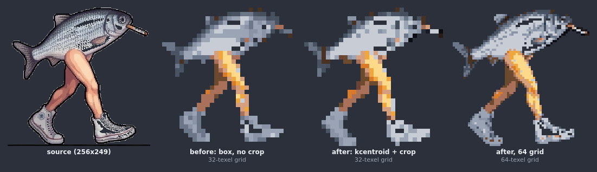
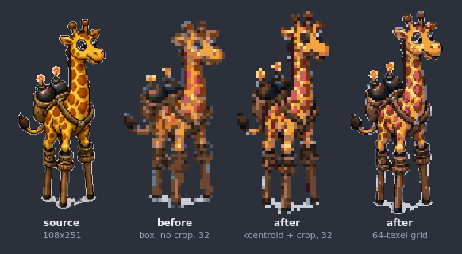

# Getting detail out of a trace — measured on five real monsters, 2026-08-02

The complaint: the traced sprites were clean but flat. The cause was the
resampler — the box average blends every texel's source pixels, so a
red-and-cream edge averages to mauve and the palette snap has to guess — plus
margin: mapping the whole image onto the grid spends texels on nothing.

Both fixes ported/derived from sprite-forge's own measured work and now the
defaults: `--resample kcentroid` and content crop (`--resample box`,
`--no-crop` keep the old arms for A/B). Test frames were auto-extracted from
the sprite-forge inbox sheets (first cell of each).

## The ablation — which lever does what (frog, 32-grid, coldcrypt)



Both box arms wash the yellow spots to grey-green; both no-crop arms are
aspect-squashed (the 208×145 frame was silently stretched onto the square
grid — the "chunky frog" was a distortion, not a style). Each lever earns its
keep independently.

## Before / after, per monster

`before` = old default (box, no crop). `after` = new default (k-centroid +
crop) at 32, then the 64-texel grid — ~4× the texel budget.







What to look for: the frog's red eyes and yellow spots exist only in the
k-centroid arms; the beaver's face and teeth likewise; the fish's cigarette
survives at 64; the stiltneck (on `tall32`/`tall64` — 64×128 added for this)
keeps its bombs and stilt joints.

| monster | before opaque | after32 | after64 | grid step |
|---|--:|--:|--:|---|
| beaver-E | 547 | 563 | 2234 | square32 → square64 |
| fish_feet-E | 336 | 360 | 1368 | square32 → square64 |
| frog-E | 731* | 520 | 2078 | square32 → square64 |
| jester-S | 599 | 755 | 3025 | square32 → square64 |
| stiltneck-E | 867 | 862 | 3422 | tall32 → tall64 |

\* the frog's *before* is higher because no-crop squashed it 1.4× — fill% here
measures aspect correction, not detail. The honest capacity number is the 64
column: ~4× the opaque texels on the figure.

## Limits, stated plainly

- **Brown-on-brown stays muddy at 32** (beaver). K-centroid picks sides only
  where a block is separable; a source that separates on hue at one value
  gives it nothing to split. Same lesson as the harlequin diamonds: author
  sources that separate on VALUE.
- **zombie-E could not be tested**: its source PNG has a baked-in checkerboard
  "transparency" pattern, which the border flood matte correctly refuses to
  key (it is not a uniform field). That sheet needs re-generation on a plain
  background before any pipeline can use it.

## Regenerating

```sh
npm run pixels -- trace <frame.png> --grid square32 --palette coldcrypt          # new defaults
npm run pixels -- trace <frame.png> --grid square32 --palette coldcrypt \
  --resample box --no-crop                                                       # the old arm
npm run pixels -- render out.json --scale 8 --backdrop dark
```
