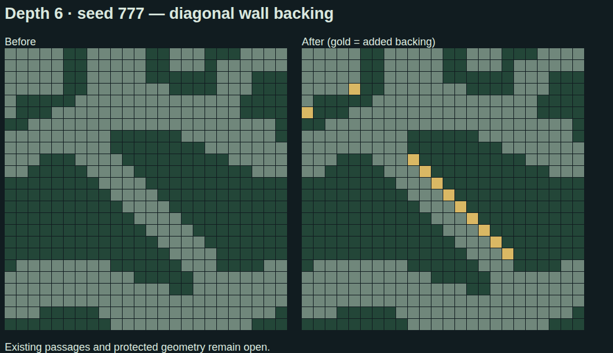

# Pinball parts and diagonal walls — 2026-09-14

The finished floor author checks powered launch exits after geometry, lamps and
density repairs. It traces actual headings through player-radius collision
geometry, follows receiving launchers and deflectors, and rejects cycles. A
launch needs a three-tile steering outlet after its maximum-speed steering lock, a verified jump
landing, or a breakable band with a clear far side. Ownership tags never waive
this check. This is a conservative spawn rule, not a complete physics simulation.

Unsafe loose launchers are removed. Unsafe structural launchers become passive
rollovers, retaining route/circuit landmarks and machine-step completion without
a forced shove. New patterns are atomic: an unsafe or missing member removes the
whole pattern. Generic re-aiming preserves these authored patterns; the final
physical gate still checks them. Passive fallbacks record their original kind
for diagnostics. The runtime corner booster also refuses its returning wall rebound
(the former signed dot-product check missed that direction).

Three rotated pattern vocabularies use the existing chain budget:

- Acceleration: three inline boosters.
- Jump relay: booster, jump pad, receiving booster.
- Chicane: two turning boosters connecting offset entry and exit lanes.

Placement respects existing component slots and occupied handoff segments. The
18-floor test (depths 1–6, seeds 1, 777, 424242) requires all three patterns to
appear and checks every final launch exit; it cannot pass by placing nothing.

Late furniture placement uses an append-only tile occupancy index for spacing
checks, including swingarms and wall-crossing mechanisms. Each added part is
indexed once. The index is scoped before the removal phase and has equivalence
coverage against the former full-array scans. The launch checker also indexes
parts by tile and follows chains iteratively rather than consuming call stack.

Run `pnpm maze:parts-bench` in ThreeJS. One local run of 30,000 spacing queries
against 10,000 parts took 1,259 ms for scans and 11.2 ms for the index, with exactly
7,487 hits in both. This is a microbenchmark, not a whole-generation or FPS claim.

Diagonal directions remain supported. Thin staircase walls receive solid 2×2
backing only where a local connectivity proof and three-tile clearance allow it.
The pass runs after doorway shaping, protects authored routes, doors, endpoints
and special shapes, and classifies the original grid so repairs cannot cascade
into room filling. Isolated L-shaped bends are left alone. Depth 6/seed 777 gains 19 backing tiles. The exact screenshot
seed was unavailable; this is a representative geometry preview, not a claim of
reproducing the annotated run or a GPU gameplay validation.

The floor geometry and population constraint gates were retained. Full-author
hashes and the 12 census JSON/SVG fixtures were refreshed for the intentional
layout/population change after those gates passed. NAS deployment remains held.

The short-runway piece gate also accepts a receiving turn only when the same
physical exit inspector proves it safe. This replaces no floor-width or
connectivity threshold. Circuit population checks count explicitly disabled
launch steps while requiring a majority to remain powered and preserving the
original >90% handoff and shared-junction constraints. Generation timing uses a
monotonic clock so wall-clock adjustments cannot produce negative durations.
