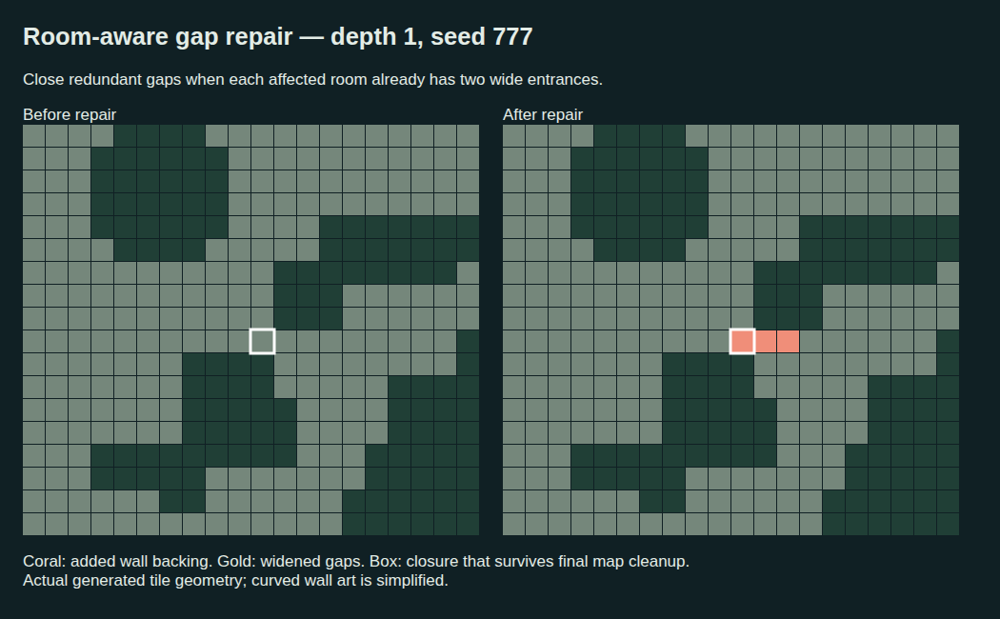

# Room entrance balancing

Tiny gaps no longer always widen. Before furniture is placed, the generator
snapshots the existing clearance-based room sections and counts distinct usable
entrances. Each connected doorway boundary counts once, including separate doors
to the same neighbouring room. An entrance must contain a clear 3×3 passage.
A redundant narrow gap can close when every adjacent room already has at least
two such entrances. The counted mouths and protected track routes remain open.
The narrow gaps themselves do not contribute to the entrance budget.

A closure is atomic: a cardinal slit needs one tile; a diagonal aperture needs
three connected wall tiles joining the existing backing. Every added tile needs
two cardinal masonry neighbours. A bounded flood fill must prove that all floor
neighbours still connect without the proposed wall. A closure that creates a new
nearby one-tile gap is rejected. Uncertain cases widen using the existing repair.
Final cleanup after furniture remains opening-only.

Room labels are calculated once per topology repair, avoiding the earlier
self-amplifying re-segmentation problem. Connectivity searches are bounded to a
25×25 neighbourhood; distant alternate routes conservatively cause widening.
This uses grid clearance and graph connectivity, without a fluid simulation.

The 15-floor sample (levels 1, 3, 6, 12, 24; seeds 1, 777, 424242) selected 47
room-aware closures. The attached example is depth 1, seed 777; coral is connected
wall backing added at a redundant diagonal gap and retained after final cleanup.

The activity search retains its coarse order, then checks the skipped tile
parities. A fixed-obstacle occupancy index and cheap pad-fit check reject
impossible replacements before copying the full furniture array. Existing
layout fixtures and launch-safety checks remain identical with this prefilter.
