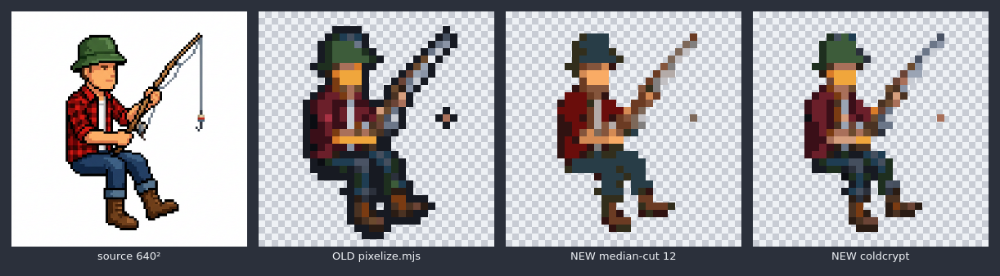
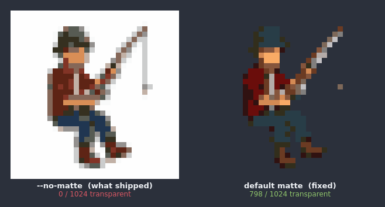
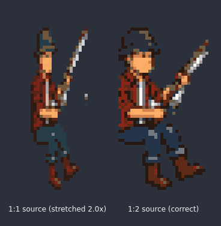

# pixel-trace vs sprite-forge — measured, 2026-08-02

Both pipelines re-run on `sprite-forge/samples/fisherman.source.png`, which is the
right control: it is the image `pixelize.mjs` was built on, and its committed
output sits beside it in the repo.



Left to right: source (640²) · old `pixelize.mjs` · new median-cut 12 · new
`--palette coldcrypt`. Checkerboard is real transparency. The old pipeline's dark
silhouette is its 1px ink outline, a step the tracer deliberately does not take.

| pipeline | format | bytes | colours | opaque | isolated % | Cold Crypt |
|---|---|--:|--:|--:|--:|--:|
| old · pixelize.mjs | PNG | 981 | 25 | 330 | 38.8 | 100% |
| new · median-cut 12 | JSON | 1604 | 12 | 226 | 29.2 | 0% |
| new · coldcrypt | JSON | 1824 | 23 | 226 | 44.2 | 100% |

**Isolated % is not a quality score.** It counts texels with no like-coloured
neighbour, and median-cut "wins" it mostly by being blurrier — the same trap
sprite-forge's README documents when it refuses to crown a resampler by census.
The 104-texel gap in opaque count is the old pipeline's outline ring, not detail.
Judge from the strip, not the column.

What the numbers *do* settle: default median-cut emits colours found nowhere in
the game (0% conformant), `--palette coldcrypt` lands 100% and matches the old
pipeline; and staying text costs ~60–85% more bytes, which is the entire trade —
those bytes buy a file a human can edit.

## Which to reach for

| | input | output | editable after | use when |
|---|---|---|---|---|
| painters | code | canvas calls | by code | animated, or needs N/S/E facings |
| sprite-forge | multi-row sheet | matted PNG + rects | no | a full creature sheet, feet-anchored |
| pixel-trace | one image, or nothing | JSON character grid | by hand | a one-off icon; hand-tuning every texel |

## Two defects the comparison caught

### 1. The background was quantised into the art



Generated art has no alpha, so it arrives on an opaque white field. Without a
matte that field was not dropped, it was quantised in as colour: **0 of 1024
texels transparent**, a solid rectangle. It passed inspection because the preview
was drawn on white — white art on a white page looks like correct art. It only
confessed against the dungeon's own stone. Fixed by porting sprite-forge's
border-reachable flood fill (an interior white shirt survives), and `render` now
draws a checkerboard by default so this cannot hide again.

### 2. A 2× stretch that reported no warning



The script this was adapted from warned on this in world-space quad terms. That
concept did not survive the port and the check went with it, so a 1:1 source on
the 32×64 grid stretched 2× vertically and returned `"warnings": []`. A stretched
figure still reads as deliberate art, just a lankier character. `ASPECT_STRETCH`
now names the ratio and the fix, and stays silent on a matching source.

## Regenerating

```sh
node tools/sprite-forge/pixelize.mjs tools/sprite-forge/samples/fisherman.source.png /tmp/old-32.png --h=32
npm run pixels -- trace tools/sprite-forge/samples/fisherman.source.png --grid square32 --colours 12 --out /tmp/new.json
npm run pixels -- render /tmp/new.json --scale 9 --backdrop dark --out /tmp/new.png
```
