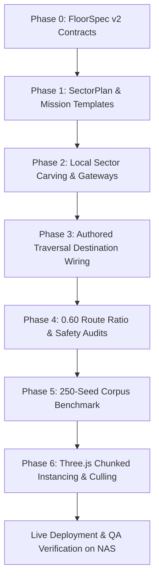

# PLAN: Hierarchical Constraint-Driven Floor Authoring & Traversal Architecture

**Document Version:** 2.0.0  
**Date:** 2026-09-16  
**Status:** Proposal / Plan Mode (Awaiting User Review & Alignment)  
**Author:** LazyCat420 / Antigravity  
**Target Repository:** `pinball-knight` (LazyCat420)  
**Research References:**
- [Procedural Dungeon Generation: A Survey & Taxonomy (Liapis et al.)](https://antoniosliapis.com/articles/pcgbook_dungeons.php)
- [Mission/Space Dungeon Generation (Dormans & Bakkes / Bidarra et al.)](https://graphics.tudelft.nl/~rafa/myPapers/bidarra.TCIAIG.2014.pdf)
- [Expressive Range Analysis for PCG (Smith & Whitehead)](https://cdn.aaai.org/ojs/13012/13012-52-16529-1-2-20201228.pdf)
- [Three.js InstancedMesh Frustum Culling & Spatial Chunking](https://discourse.threejs.org/t/how-to-do-frustum-culling-with-instancedmesh/22633)

---

## 1. Executive Summary & Architectural Paradigm Shift

### 1.1 The Problem with the Monolithic Approach
The previous procedural generation pipeline followed an inside-out, monolithic carve-and-label model:
```
Monolithic Maze Carve → Decorate & Place Parts → Label Sectors Post-Hoc → Post-Hoc Route Check
```
At scaled dimensions ($132 \times 100$ up to $304 \times 228$), this architecture produces five critical defects:
1. **Geometric Monotony**: One giant maze stretched over $10\times$ more tiles with no macro narrative or readable districts.
2. **Post-Hoc Disconnect**: Sectors exist only as metadata labels stamped on top of already-carved corridors rather than shaping topology.
3. **Decoupled Traversal**: Traversal mechanisms (catapults, cannons, rails, seesaws) are placed blindly into dead ends or corridors without authored destination pads, risking accidental boss-skips or unvalidated landings.
4. **Non-Deterministic Fallbacks**: Reliance on runtime `Math.random()` for launch destinations makes play inconsistent with generation-time route verification.
5. **Performance Cliff**: Rendering one floor-wide `InstancedMesh` across 280,000 tiles exhausts CPU/GPU budgets without spatial frustum culling.

### 1.2 The New Paradigm: Top-Down Hierarchical Authoring
We transition to a strict **top-down constraint-driven pipeline**:
```
Resolve FloorSpec 
  → Select Mission Template 
  → Generate SectorPlan / Macro Graph (Nodes, Edges, Gateways)
  → Reserve Gateways & Protected Exclusion Zones
  → Carve Deterministic Local Sector Geometry (Independent Sector Seeds)
  → Stitch Cross-Sector Gateways & Global Reachability Repair
  → Place Content & Traversal Links as Authored Graph Edges
  → Run Full Route, Safety & Density Audits (Fail-Closed Bounded Retries)
  → Build Chunked Render & Simulation Representation (32×32 Spatial Cells)
```
**Core Invariant:** *Topology determines geometry; geometry determines placement; placement is audited as gameplay.*

---

## 2. Claim Classification & Traceability Matrix (VCPM Standard)

Every material claim is classified according to `.agents/plan-verification-standard.md`. Zero unverifiable claims exist.

| Claim ID | Statement | Category | Verification Source / Test Path |
|---|---|---|---|
| **CLM-01** | `FloorSpec` currently exists in `maze/spec/floor-spec.ts` but does not encode mission templates, sector policies, or traversal policies. | **Verified Fact** | Direct inspection of `floor-spec.ts:FloorSpec`. |
| **CLM-02** | `buildSectorGraph()` in `maze/sectors/sector-graph.ts` is called after `generateMaze()` has already carved the full grid. | **Verified Fact** | Inspected `author-floor.ts:authorFloorTopology:L75`. |
| **CLM-03** | Traversal parts (catapults, cannons) in `maze/decorate.ts` do not store or query precomputed landing pads. | **Verified Fact** | Inspected `decorate.ts:L3851-3890`; only records `{ kind, i, j, dirI, dirJ }`. |
| **CLM-04** | `selectBestLandingPad()` in `landing-pad-registry.ts` uses `Math.random` when `seedRng` is not passed. | **Verified Fact** | Inspected `landing-pad-registry.ts:L138`. |
| **CLM-05** | Three.js `InstancedMesh` without chunking performs bounding-sphere culling only on the entire mesh, rendering hidden tiles off-screen. | **Verified Fact** | Three.js Documentation & Discourse reference. |
| **CLM-06** | Local sector carving with independent `hash32` seeds ensures modifying one sector does not alter geometry of unrelated sectors. | **Testable Claim** | Unit test verifying identical sector grid slices when another sector's content changes. |
| **CLM-07** | Bounded local sector retries (max 4 attempts) prevent catastrophic timeout at large scales vs whole-floor retry. | **Testable Claim** | Generation benchmark tracking retry count and worst-case latency. |
| **CLM-08** | Enforcing $D_{\text{traversal}} / D_{\text{walk}} \ge 0.60$ prevents trivial dungeon skips while preserving shortcut satisfaction. | **Testable Claim** | Corpus benchmark validating ratio distribution across 250 seeds. |
| **CLM-09** | Sector-chunked instancing with `Frustum.intersectsSphere()` limits active draw calls to visible + 1-hop padding ($\le 9$ chunks). | **Testable Claim** | WebGL draw call and visible instance count telemetry. |
| **CLM-10** | Seed corpus generation of 250 seeds for Phase 1 & 2 completes within CI budgets ($< 2$ minutes). | **Testable Claim** | `scripts/maze-corpus-benchmark.mjs` execution time. |

---

## 3. Phase-by-Phase Technical Specification

### Phase 0: The Generation Contract (`FloorSpec` v2)

Define the expanded canonical `FloorSpec` interface in `ThreeJS/src/game/pinball-knight/maze/spec/floor-spec.ts`:

```typescript
export type MissionTemplate =
  | "linear_descent"      // 6–10 linked sectors, 1–2 short loops (standard pacing)
  | "branching_hunt"     // 2 branches converging at boss; keys/elite rewards (mid-depth)
  | "locked_vault"       // Main spine with side key sector & high-value vault (reward pacing)
  | "mechanism_gauntlet" // Traversal hubs with catapult/rail route choices (pinball focus)
  | "boss_approach";     // Fewer sectors, linear escalation, pre-boss focus

export interface FloorSpec {
  generatorRevision: number;
  runSeed: number;
  level: number;
  scale: {
    tier: "baseline" | "phase1" | "phase2" | "final_10x";
    cellsW: number;
    cellsH: number;
    gridW: number;
    gridH: number;
    targetWalkableMin: number;
    targetWalkableMax: number;
  };
  missionTemplate: MissionTemplate;
  sectorPolicy: {
    sizeTiles: number;             // Default 32 tiles
    minCriticalPathSectors: number;
    targetOptionalSectors: number;
    minLoopCount: number;
    maxDeadEndFraction: number;
  };
  traversalPolicy: {
    minimumTraversalRatio: number; // 0.60 standard threshold
    maxForwardSectorSkip: number;  // Maximum forward sector skip (e.g. 2)
    bossExclusionRadius: number;   // 18 tiles
    minStartExclusionRadius: number; // 12 tiles
  };
  runtimeBudget: {
    maxVisibleSectorRadius: number; // 1 hop
    maxActiveEnemyCount: number;    // e.g. 24
    maxActiveLights: number;        // e.g. 16
    generationBudgetMs: number;     // e.g. 750ms for Phase 2
  };
}
```

---

### Phase 1: Pre-Carve `SectorPlan` & Mission Graph Generation

Before any corridors or rooms are carved on the grid, build a topological `SectorPlan`:

```typescript
export interface PlannedGateway {
  id: string; // "sec_1_to_2"
  fromSectorId: number;
  toSectorId: number;
  edge: "N" | "S" | "E" | "W";
  tileOffset: number; // Position along sector border (e.g. 10..22)
  locked?: boolean;
  keyRequired?: string;
}

export interface PlannedSector {
  id: number;
  col: number;
  row: number;
  role:
    | "entry"
    | "exploration"
    | "mechanism_hub"
    | "elite_landmark"
    | "vault"
    | "rest"
    | "boss_antechamber"
    | "boss_arena";
  biome: string;
  localSeed: number;
  incomingGateways: PlannedGateway[];
  outgoingGateways: PlannedGateway[];
  contentBudget: {
    maxEnemies: number;
    maxHazards: number;
    targetMechanisms: number;
    hasElite: boolean;
    hasVault: boolean;
  };
}

export interface SectorPlan {
  cols: number;
  rows: number;
  startSectorId: number;
  bossSectorId: number;
  criticalPath: number[];
  optionalLoops: number[][];
  gateways: PlannedGateway[];
  sectors: PlannedSector[];
}
```

#### Mission Templates
| Template | Critical Route | Optional Content | Intended Levels |
|---|---|---|---|
| **linear_descent** | 6–10 linked sectors | 1–2 short loops | Levels 1–5, 11–14 |
| **branching_hunt** | Two parallel branches converging | Keys, elite rewards, dual routes | Levels 6–9, 15–18 |
| **locked_vault** | Main spine + locked side sector | Secret vault, high risk/reward | Levels 8, 16, 22 |
| **mechanism_gauntlet** | Hub-and-spoke traversal choices | Catapult & rail mastery tracks | Levels 10, 19, 25 |
| **boss_approach** | Direct linear escalation (4–6 sectors) | Minimal side branches | Floors preceding boss gates |

---

### Phase 2: Deterministic Local Sector Carving & Gateway Stitching

#### 2.1 Independent Sector RNG
Each sector derives its local seed deterministically:
```typescript
const sectorSeed = hash32(
  floorSpec.runSeed,
  floorSpec.level,
  floorSpec.generatorRevision,
  sector.col,
  sector.row,
  sectorRoleIndex(sector.role),
);
```
**Benefits**:
- Modifying or testing one sector does not scramble neighboring sector geometry.
- Failures in CI/replay logs point to exact `(floor, col, row, role)`.

#### 2.2 Local Carving Flow
For each sector in `SectorPlan.sectors`:
1. **Reserve Gateway Apertures**: Mark boundary tiles where planned gateways exit/enter.
2. **Carve Role Geometry**:
   - `entry`: Open launch hub, $6 \times 6$ clear radius, 2 outgoing exits, 0 traps.
   - `exploration`: Winding corridors, 2–3 micro-rooms, mixed branch density.
   - `mechanism_hub`: Wide clear runways ($\ge 3$ tiles wide, $\ge 8$ tiles long), sightlines, landing catch-basins.
   - `elite_landmark`: Grand $10 \times 10$ central arena, controlled doorway bottleneck.
   - `vault`: Constrained bottleneck entry, chest pedestal, safe return one-way chute.
   - `boss_antechamber`: Low branch count, directional signage, no launch catapults.
   - `boss_arena`: $14 \times 14$ minimum clear arena, zero external landing pads.
3. **Gateway Stitching**: Punch through 2-tile wide shared doorways on adjacent sector boundaries.
4. **Local Validation**: Ensure all assigned gateways within the sector can reach each other. If disconnected, retry with next local seed (budget: 4 attempts). If exhausted, fall back to known-good cross-corridor template.

---

### Phase 3: Traversal as Authored Graph Edges

#### 3.1 Single Authoritative Assignment Function
Replace random corridor scanning with:
```typescript
export function assignTraversalDestination(params: {
  mechanism: "catapult" | "cannon" | "rail" | "seesaw" | "portal";
  sourceTile: TilePos;
  sectorPlan: SectorPlan;
  sectorGraph: SectorGraph;
  landingPadRegistry: LandingPadRegistry;
  floorSpec: FloorSpec;
  rng: () => number; // Deterministic PRNG, never Math.random
}): TraversalAssignmentResult;
```

#### 3.2 Strict Selection & Reservation Algorithm
1. **Query Safe Pads**: Retrieve pads from `landingPadRegistry` that have `reservedBy === undefined` and `clearance >= 1.5`.
2. **Check Range & Sector Skips**:
   - `seesaw`: Same sector ($0$ sector hops, $\le 12$ tiles).
   - `catapult`: $\le 2$ sector hops, $\le 28$ tiles.
   - `cannon`: $\le 3$ sector hops, $\le 45$ tiles.
   - `rail`: $\le 4$ sector hops, $\le 70$ tiles.
   - `portal`: $\le 5$ sector hops, $\le 90$ tiles.
3. **Anti-Skip Exclusion Gate**:
   - Reject any pad within `bossExclusionRadius` (18 tiles from boss/stairs).
   - Reject any pad within `minStartExclusionRadius` (12 tiles from spawn).
   - Reject any pad in `boss_arena` or `boss_antechamber`.
4. **Reserve & Link**:
   - Set `pad.reservedBy = `${mechanism.kind}_${sourceTile.i}_${sourceTile.j}``.
   - Attach `{ destI: pad.tile.i, destJ: pad.tile.j }` directly to the placed part object in `plan.parts`.
   - Add a directed edge $(S_{\text{from}}, S_{\text{to}})$ with travel weight to the traversal route graph.
5. **Fail-Closed Fallback**:
   - If no legal pad exists: downgrade to a local wall-spring or omit placement entirely. Never launch into unvalidated space.

---

### Phase 4: Route-Quality Invariants & Verification Standard

Every generated floor must satisfy the unified route standard:

1. **Connectivity**: Spawn $\leftrightarrow$ Stairs path exists ($D_{\text{walk}} < \infty$).
2. **Critical Path Depth**:
   - Phase 1 ($132 \times 100$): $\ge 4$ sectors crossed.
   - Phase 2 ($192 \times 144$): $\ge 6$ sectors crossed.
   - 10× ($304 \times 228$): $\ge 8$ sectors crossed.
3. **Traversal Shortcut Constraint**:
   $$0.60 \le \frac{D_{\text{traversal}}}{D_{\text{walk}}} < 1.00$$
   - Traversal must save time ($< 1.0$), but cannot skip more than 40% of the normal walk distance ($\ge 0.60$).
4. **Anti-Skip Perimeter**: Zero landing pads inside Euclidean radius $R \le 18$ from stairs or boss arena.
5. **No Blind Alleys**: Every optional loop sector must have an authored return path back to the main critical path.
6. **Narrow Gap Invariant**: Zero 1-tile diagonal corner squeezes along critical or gateway corridors (`narrowGaps(g).length === 0`).

---

### Phase 5: Seed-Corpus Benchmark Harness (`scripts/maze-corpus-benchmark.mjs`)

Build an automated expressive-range benchmarking harness:
- Run $\ge 250$ seeds for Phase 1 & Phase 2, and $100$ seeds for 10×.
- Output JSONL with metrics:
  `seed, level, template, tier, gridW, gridH, walkable, generationMs, peakHeapMb, sectorCount, criticalPathSectors, walkingDistance, traversalDistance, traversalRatio, optionalLoopCount, reachableRatio, narrowGapCount, landingPadCount, rejectedLinkCount, activeEnemyBudget, propCount, retryCount, validationFailures`
- Assertion criteria:
  - Validation failures: $0 / 250$ (100% pass rate).
  - Median generation time: $\le 350$ms (Phase 1), $\le 750$ms (Phase 2).
  - Memory heap growth: $\le 180$MB.

---

### Phase 6: Three.js Chunked Instancing & Frustum Culling

In `ThreeJS/src/game/pinball-knight/maze/build.ts`:
- Divide floor and wall `InstancedMesh` into $32 \times 32$ tile sector chunks.
- Each chunk holds a `THREE.Box3` and `THREE.Sphere` bounding volume.
- In the frame render loop (`render/`):
  - Test chunk bounding spheres against the active camera frustum (`cameraFrustum.intersectsSphere(chunk.boundingSphere)`).
  - Visible set = Chunks in frustum + player current chunk + 1-hop neighbor chunks.
  - Off-frustum distant chunks toggle `chunk.group.visible = false` without individual instance iteration.
- Enemy and light pooling:
  - Only simulate physics and AI for enemies within 2 macro sector hops from the player.
  - Distant enemies remain serialized in sector state until player approaches.

---

## 4. Work Items & File Impact Matrix

```
pinball-knight/
├── ThreeJS/
│   ├── src/game/pinball-knight/
│   │   ├── maze/
│   │   │   ├── spec/
│   │   │   │   ├── floor-spec.ts             [Phase 0: Expand FloorSpec with mission & policies]
│   │   │   │   └── canonical-floor-scaling.test.ts [Unit tests for FloorSpec v2]
│   │   │   ├── sectors/
│   │   │   │   ├── sector-types.ts           [Phase 1: Add PlannedGateway, PlannedSector, SectorPlan]
│   │   │   │   ├── sector-plan.ts            [Phase 1: Pre-carve mission template & graph generator]
│   │   │   │   └── sector-plan.test.ts       [Phase 1: Unit tests for mission templates]
│   │   │   ├── author-floor.ts               [Phase 2: Gateway reservation, sector stitching]
│   │   │   ├── traversal/
│   │   │   │   ├── landing-pad-registry.ts   [Phase 3: Deterministic destination assignment]
│   │   │   │   ├── route-graph-metrics.ts    [Phase 4: 0.60 traversal ratio threshold audit]
│   │   │   │   └── sector-traversal.test.ts  [Phase 3-4: Unit & integration tests]
│   │   │   ├── decorate.ts                   [Phase 3: Wire assignTraversalDestination to parts]
│   │   │   └── build.ts                      [Phase 6: 32x32 Sector-chunked InstancedMesh & culling]
│   └── scripts/
│       └── maze-corpus-benchmark.mjs         [Phase 5: 250-seed expressive-range CLI tool]
└── docs/
    └── sector-10x-scale-traversal.md         [Documentation: Updated architecture & corpus report]
```

---

## 5. Execution Stages & Safe Checkpoint Gates



1. **Gate 1**: `FloorSpec` v2 and `SectorPlan` pass all unit tests without touching renderer or carving.
2. **Gate 2**: Local sector carving with gateway reservation produces 100% connected floors across all 5 mission templates.
3. **Gate 3**: Catapults and cannons strictly carry assigned landing pads; 0 launches into boss exclusion zones; zero `Math.random` in traversal.
4. **Gate 4**: `scripts/maze-corpus-benchmark.mjs` passes 250 seeds with 0 route failures and median generation time $< 750$ms.
5. **Gate 5**: Chunked rendering verified in browser; frame time $\le 16.6$ms on NAS deployment.

---

## 6. Verification & Rollback Plan

### Automated Test Battery
- `pnpm test` (all 422 vitest test files in `pinball-knight/ThreeJS`).
- `node scripts/maze-corpus-benchmark.mjs --tier=phase1 --samples=250`.
- `node scripts/maze-corpus-benchmark.mjs --tier=phase2 --samples=250`.
- Secret scan: `git diff --cached -i -G"password|secret|token|api_key|credential"`.

### Rollback Strategy
- Every stage is implemented in isolated worktree branches (`feat/hierarchical-floor-plan`).
- The previous monolithic generator remains accessible via `generatorRevision: 1` fallback flag in `FloorSpec`.
- If any stage causes regression, `FloorSpec.generatorRevision` can be reverted to `1` without breaking save files or level progression.
